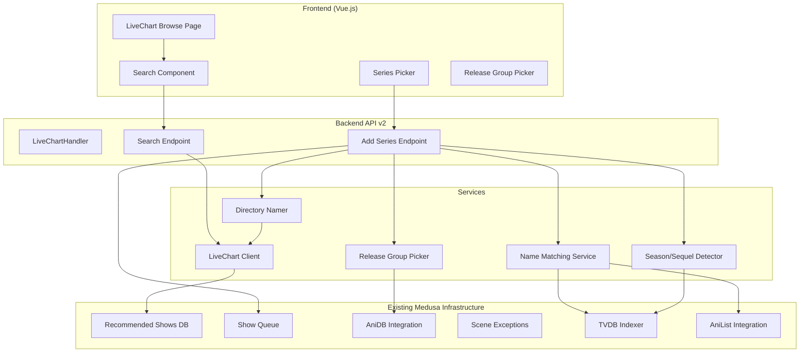
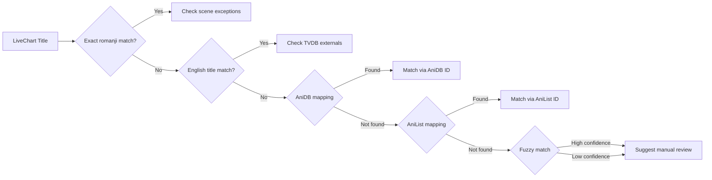
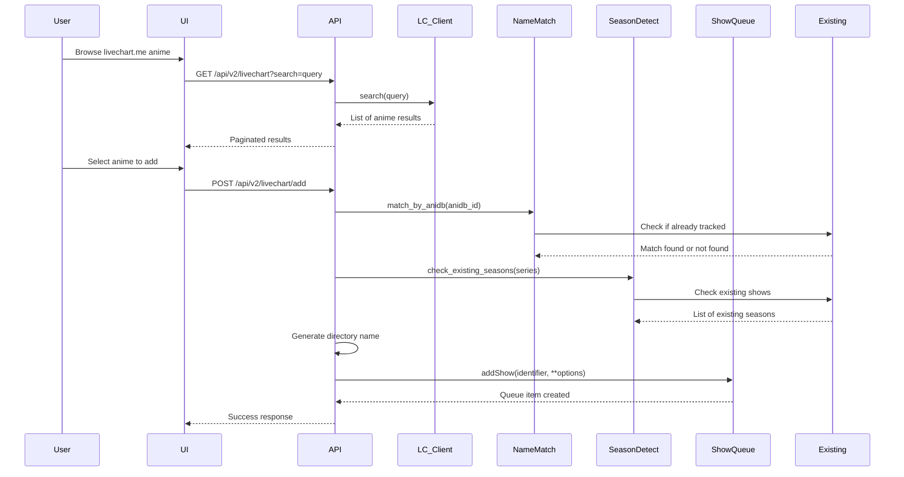
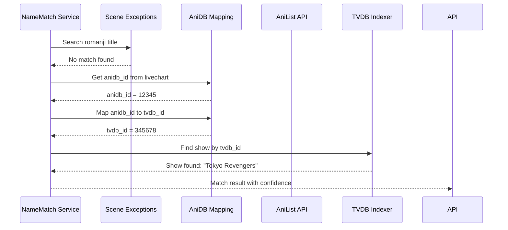
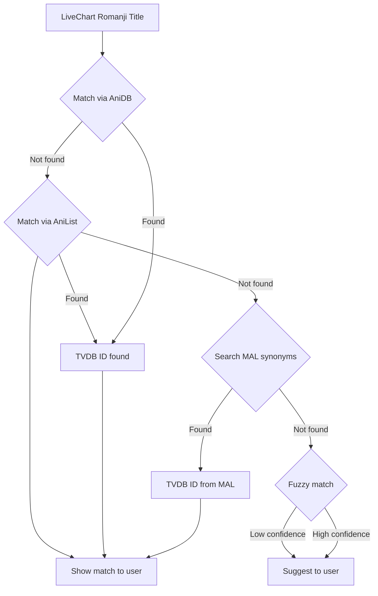

# LiveChart.me Anime Integration Plan

## Overview

This plan describes the implementation of a new feature to look up anime series from `https://www.livechart.me` and allow users to pick and choose shows to add to Medusa.

## Architecture Diagram



## Component Design

### 1. LiveChart Client (`medusa/clients/livechart.py`)

A new client module to interact with livechart.me.

**Purpose**: Fetch anime data from livechart.me including series information, seasons, and metadata.

**Key Methods**:
- `search(query)`: Search for anime by title
- `get_series(anime_id)`: Get full series details including all seasons
- `get_upcoming()`: Get upcoming anime releases
- `get_seasonal_anime(year, season)`: Get seasonal anime lineup

**Data Model**:
```python
class LiveChartSeries:
    anime_id: int          # livechart.me anime ID
    title_japanese: str    # Japanese title (e.g., 東京リベンジャーズ)
    title_romanji: str     # Romanji title (e.g., Tokyo Revengers)
    title_english: str     # English title (e.g., Tokyo Revengers)
    title_synonyms: list   # Alternative titles
    synopsis: str
    anime_type: str        # TV, OVA, Movie, etc.
    status: str            # airing, finished, upcoming
    start_date: str
    end_date: str
    season: str            # Spring, Summer, Fall, Winter
    year: int
    score: float
    genres: list
    image_url: str
    seasons: list[LiveChartSeason]
    anidb_id: int          # Mapped AniDB ID (if available)
    anilist_id: int        # Mapped AniList ID (if available)
    tvdb_id: int           # Mapped TVDB ID (if available)
```

**Implementation Approach**:
- Use the existing `MedusaSession` for HTTP requests (same as AniList client)
- Implement GraphQL queries if livechart.me has a GraphQL API, otherwise use HTML parsing with BeautifulSoup (existing in `medusa/bs4_parser.py`)
- Cache responses using the existing `recommended_series_cache` system

### 2. Name Matching Service (`medusa/helpers/livechart_match.py`)

**Purpose**: Match livechart.me anime titles to existing Medusa shows using various name matching strategies.

**Challenge**: livechart.me uses Japanese romanji titles while Medusa typically uses English titles.

**Matching Strategy** (priority order):



**Key Methods**:
- `match_by_romanji(romanji_title)`: Search scene exceptions for romanji matches
- `match_by_english(english_title)`: Search for English title matches
- `match_by_anidb(anidb_id)`: Match using AniDB ID mapping
- `match_by_anilist(anilist_id)`: Match using AniList ID mapping
- `find_similar_titles(title)`: Fuzzy matching for similar titles
- `get_all_possible_matches(title)`: Return all potential matches with confidence scores

**Integration Points**:
- Leverage existing [`scene_exceptions.py`](medusa/scene_exceptions.py) system for name mappings
- Use existing [`cached_tvdb_to_aid()`](medusa/show/recommendations/recommended.py:359) and [`cached_aid_to_tvdb()`](medusa/show/recommendations/recommended.py:369) functions for AniDB mappings
- Use AniList API to cross-reference anime data

### 3. Season/Sequel Detector (`medusa/helpers/season_detector.py`)

**Purpose**: Detect if a livechart.me anime is a continuation or has existing seasons already tracked in Medusa.

**Key Methods**:
- `detect_seasons(series)`: Identify all seasons/continuations of a series
- `check_existing_seasons(series)`: Check which seasons are already in Medusa
- `find_related_series(title)`: Find related series (prequels, sequels, spin-offs)

**Implementation**:
- Parse series title to extract season indicators (e.g., "Season 2", "Part 2", "Z", "X")
- Use AniDB relationships to find related anime
- Check existing Medusa show list for matching titles
- Return structured data about which seasons exist and which are new

### 4. Directory Namer (`medusa/helpers/dir_namer.py`)

**Purpose**: Generate directory names in the format `<japanese name> (<year>)`.

**Key Methods**:
- `generate_anime_directory(series, root_path)`: Generate full path
- `format_japanese_name(series)`: Format Japanese name for directory

**Format**: `/media/videos/Anime/Toujima Tanzaburou wa Kamen Rider ni Naritai (2025)`

**Implementation**:
- Use `title_japanese` or `title_romanji` from livechart.me
- Append year in parentheses
- Handle directory name sanitization (remove invalid characters)
- Check for existing directories to avoid conflicts

### 5. Release Group Picker Integration

**Purpose**: Allow users to select preferred release groups when adding anime.

**Integration with Existing Code**:
- Leverage existing [`get_release_groups_for_anime()`](medusa/helpers/anidb.py:50) function
- Use existing release group whitelisting/blacklisting system in [`Series`](medusa/tv/series.py:210) class
- The [`whitelist`](medusa/tv/series.py:775) and [`blacklist`](medusa/tv/series.py:761) properties handle release groups

**Key Methods**:
- `get_available_groups(series_name)`: Get release groups from AniDB
- `filter_by_preference(groups, user_preferences)`: Filter groups based on user preferences
- `apply_release_group_preferences(series, selected_groups)`: Apply to series object

### 6. API v2 Handler (`medusa/server/api/v2/livechart.py`)

**Purpose**: RESTful API endpoints for livechart.me integration.

**Following the pattern of [`RecommendedHandler`](medusa/server/api/v2/recommended.py:22):**

```python
class LiveChartHandler(BaseRequestHandler):
    """Request handler for livechart.me anime search."""
    
    name = 'livechart'
    allowed_methods = ('GET', 'POST')
    
    def get(self, path_param=None):
        """Get livechart anime data.
        
        Query params:
        - search: Search query
        - year: Filter by year
        - season: Filter by season (SPRING, SUMMER, FALL, WINTER)
        - page: Page number for pagination
        """
        
    def post(self, path_param=None):
        """Add a series from livechart.me to Medusa.
        
        Request body:
        {
            "anime_id": 12345,
            "title_japanese": "東京リベンジャーズ",
            "title_english": "Tokyo Revengers",
            "year": 2021,
            "root_dir": "/media/videos/Anime",
            "anime": true,
            "release_groups": ["SubGroup1", "SubGroup2"],
            "default_status": "wanted"
        }
        """
```

**API Endpoints**:
| Method | Path | Description |
|--------|------|-------------|
| GET | `/api/v2/livechart` | Search/get livechart anime |
| GET | `/api/v2/livechart/upcoming` | Get upcoming anime |
| GET | `/api/v2/livechart/seasonal` | Get seasonal anime |
| GET | `/api/v2/livechart/search` | Search by query |
| POST | `/api/v2/livechart/add` | Add series to Medusa |
| GET | `/api/v2/livechart/match` | Get match suggestions for a series |

### 7. Registration

**API v2 handlers registration** - Add to [`medusa/server/core.py`](medusa/server/core.py:89):
```python
# In get_apiv2_handlers():
from medusa.server.api.v2.livechart import LiveChartHandler

handlers.append(LiveChartHandler.create_handler(base))
```

**Indexer config** - Add to [`medusa/indexers/config.py`](medusa/indexers/config.py):
```python
EXTERNAL_LIVECHART = 14  # Next available external indexer ID

EXTERNAL_MAPPINGS = {
    EXTERNAL_ANIDB: 'anidb_id',
    INDEXER_TVRAGE: 'tvrage_id',
    EXTERNAL_TRAKT: 'trakt_id',
    EXTERNAL_ANILIST: 'anilist_id',
    EXTERNAL_LIVECHART: 'livechart_id'  # New mapping
}

indexerConfig['LIVECHART'] = {
    'id': EXTERNAL_LIVECHART,
    'name': 'LiveChart',
    'api': 'livechart',
    'episode_url': 'https://www.livechart.me/anime/{id}',
    'series_url': 'https://www.livechart.me/anime/{id}',
}
```

## File Structure

```
medusa/
├── clients/
│   └── livechart.py              # NEW: LiveChart.me API client
├── helpers/
│   └── livechart_match.py        # NEW: Name matching service
│   └── season_detector.py        # NEW: Season/sequel detection
├── server/
│   └── api/
│       └── v2/
│           └── livechart.py      # NEW: API v2 handler
├── show/
│   └── recommendations/
│       └── livechart.py          # NEW: LiveChart recommendation class
└── queues/
    └── show_queue.py             # MODIFIED: Add livechart-specific options
```

## Data Flow

### Adding a Series from LiveChart.me



### Name Matching Flow



## Configuration

Add to [`medusa/app.py`](medusa/app.py):

```python
# LiveChart settings
self.LIVECHART_CACHE_DIR = None  # Will be set to cache/recommended
self.CACHE_RECOMMENDED_LIVECHART = True  # Enable caching
self.LIVECHART_UPDATE_HOUR = 6  # Hour to update recommendations
```

Add to config section in [`medusa/__main__.py`](medusa/__main__.py):

```python
new_config['LiveChart'] = {}
new_config['LiveChart']['enabled'] = int(app.LIVECHART_ENABLED)
new_config['LiveChart']['cache'] = int(app.CACHE_RECOMMENDED_LIVECHART)
```

## UI Components

The UI should follow the existing patterns in the themes directory:

1. **LiveChart Browse Page** (`/home/addShows/livechart`):
   - Grid view of anime posters
   - Search bar at top
   - Filter by season/year
   - "Already in Library" badges
   - "Add" buttons

2. **Series Detail Modal**:
   - Show title (Japanese + English)
   - Synopsis
   - Season list with existing status
   - Release group selection
   - Directory preview

3. **Release Group Picker**:
   - Dropdown or multi-select
   - Uses existing AniDB release group data
   - Shows group quality preferences

## Implementation Phases

### Phase 1: Core Client & API
- Create `medusa/clients/livechart.py`
- Create `medusa/server/api/v2/livechart.py`
- Register API endpoints
- Basic search functionality

### Phase 2: Name Matching
- Create `medusa/helpers/livechart_match.py`
- Implement AniDB/AniList cross-referencing
- Add scene exception lookups
- Test with known anime titles

### Phase 3: Season Detection & Directory Naming
- Create `medusa/helpers/season_detector.py`
- Implement directory naming logic
- Test with various anime naming conventions

### Phase 4: Release Group Integration
- Integrate with existing AniDB release group system
- Add release group picker to UI
- Test with known anime releases

### Phase 5: UI Components
- Create Vue.js components for livechart browsing
- Add navigation to add shows page
- Implement series detail modal
- Add release group picker UI

### Phase 6: Testing & Polish
- End-to-end testing
- Error handling improvements
- Performance optimization
- Documentation

## Key Considerations

### 1. Name Matching Challenges

The romanji-to-English name mismatch is the most complex aspect. Strategies:

- **Primary**: Use AniDB/AniList cross-references (both databases have consistent ID mappings)
- **Secondary**: Use scene exceptions system for manual mappings
- **Fallback**: Fuzzy matching with user confirmation

### 2. Season/Sequel Handling

- Some series have different names per season (e.g., "Fate/stay night: Unlimited Blade Works")
- Use AniDB relationships to identify prequels/sequels
- Check existing shows by multiple name variants

### 3. Directory Naming

**Configurable directory naming pattern:**

The directory naming will be configurable via the Medusa config system. Default format: `<japanese name> (<year>)`.

**Configuration options** (in `medusa/app.py`):
```python
# Anime directory naming settings
self.ANIME_DIR_NAME_USE_JAPANESE = True  # Use Japanese/Romanji name instead of English
self.ANIME_DIR_NAME_PATTERN = '{title_japanese} ({year})'  # Configurable pattern
```

**Supported pattern variables:**
| Variable | Description | Example |
|----------|-------------|---------|
| `{title_japanese}` | Japanese title (e.g., 東京リベンジャーズ) | 東京リベンジャーズ |
| `{title_romanji}` | Romanji title (e.g., Tokyo Revengers) | Tokyo Revengers |
| `{title_english}` | English title | Tokyo Revengers |
| `{year}` | Start year | 2025 |
| `{title}` | Primary title (configurable which to use) | Tokyo Revengers |

**Examples:**
- Default: `Toujima Tanzaburou wa Kamen Rider ni Naritai (2025)`
- Japanese only: `東京リベンジャーズ (2021)`
- Romanji with year: `Tokyo Revengers (2025)`
- English only: `Tokyo Revengers`

**Implementation:**
- Use Python's string formatting with pattern variables
- Sanitize directory names for filesystem compatibility (remove invalid characters)
- Check for existing directories to avoid conflicts
- Fall back to English title if Japanese name is unavailable

### 4. Release Groups

- "Group" in anime context = subtitle release group (e.g., "SubsPlease", "HorribleSubs")
- Use existing AniDB integration for group data
- Allow per-series group preferences
- Support group whitelisting/blacklisting

## Dependencies

This feature leverages existing Medusa infrastructure:
- **AniDB**: For anime ID mappings and release groups
- **AniList**: For cross-referencing anime data
- **Scene Exceptions**: For name mappings
- **Show Queue**: For adding shows to Medusa
- **Recommended Shows System**: For caching and display

## Testing Strategy

1. **Unit Tests**: Test name matching with known anime pairs
2. **Integration Tests**: Test full add series flow
3. **API Tests**: Test all API endpoints
4. **UI Tests**: Test user interactions

## Release Group Priority System

**How release groups work in Medusa:**

Medusa uses a whitelist/blacklist system (implemented in [`BlackAndWhiteList`](medusa/black_and_white_list.py:33)) for anime release groups:

- **Whitelist**: If a whitelist is defined, ONLY releases from whitelisted groups are downloaded
- **Blacklist**: Releases from blacklisted groups are always excluded
- **Priority**: Both lists are stored in the database per-show (`blacklist` and `whitelist` tables in [`main_db.py`](medusa/databases/main_db.py:250-251))
- **Evaluation**: In [`is_valid()`](medusa/black_and_white_list.py:126), the check is:
  1. If no whitelist AND no blacklist: pass (any group is fine)
  2. If whitelist exists: release group must be in whitelist
  3. If blacklist exists: release group must NOT be in blacklist
  4. Both conditions must pass

**User preferences:**
- Users can set per-series release group preferences via the [`AniDBReleaseGroupUI`](themes-default/slim/src/components/anidb-release-group-ui.vue:52) component
- Groups are fetched from AniDB via [`get_release_groups_for_anime()`](medusa/helpers/anidb.py:50)
- The UI shows three columns: Whitelist (left), Available Groups (center), Blacklist (right)
- Users drag/click arrows to move groups between lists

**For livechart.me integration:**
- Release groups will be fetched from AniDB (same as existing flow)
- Users can configure preferred groups during the add-series flow
- The group picker will use the same UI component (`anidb-release-group-ui.vue`)

## Multiple Sources Support

The implementation will support multiple anime lookup sources with a unified interface:

### Source 1: LiveChart.me (Primary)
- **Access method**: HTML scraping (no API available)
- **URL pattern**: `https://www.livechart.me/anime/{id}`
- **Data available**: Anime titles (Japanese, Romanji, English), seasons, air dates, genres, synopsis, images
- **Seasonal pages**: `https://www.livechart.me/upcoming` for upcoming anime

### Source 2: MyAnimeList.net (Backup - Scraping)
- **Access method**: HTML scraping (no API initially, API access pending review)
- **URL patterns**:
  - Seasonal anime: `https://myanimelist.net/anime/season/{year}/{season}` (e.g., `2026/summer`)
  - Anime detail: `https://myanimelist.net/anime/{id}/{slug}`
  - Search: `https://myanimelist.net/anime?q={query}`
- **API docs** (for future): https://myanimelist.net/apiconfig/references/api/v2
- **Data available**: Anime titles (Japanese, English, Synonyms), episodes, members, score, genres, synopsis, images
- **Seasons**: Spring, Summer, Fall, Winter

### Source 3: MyAnimeList.net (Future - API)
- Once API access is approved, switch from scraping to API calls
- API endpoint: `https://api.myanimelist.net/v2`
- Same architecture, just replace the scraping client with API client

### Source Comparison

| Feature | LiveChart.me | MyAnimeList (Scraping) | MyAnimeList (API) |
|---------|--------------|------------------------|-------------------|
| Titles | Japanese, Romanji, English | Japanese, English, Synonyms | Japanese, English, Synonyms |
| Seasons | Yes (airing schedule) | Yes (season/year metadata) | Yes (season/year metadata) |
| Release Groups | Via AniDB integration | Via AniDB integration | Via AniDB integration |
| Score/Rating | Yes | Yes | Yes |
| Genres | Yes | Yes | Yes |
| Synonyms | Limited | Extensive | Extensive |
| Rate Limit | N/A | ~10 req/sec (unauthenticated) | Per API key limits |

### Unified Source Abstraction

```python
class AnimeSource(ABC):
    """Abstract base class for anime lookup sources."""

    @abstractmethod
    async def search(self, query: str) -> List[AnimeSeries]:
        """Search for anime by title."""
        pass

    @abstractmethod
    async def get_seasonal(self, year: int, season: str) -> List[AnimeSeries]:
        """Get seasonal anime for a given year/season."""
        pass

    @abstractmethod
    async def get_details(self, anime_id: int) -> AnimeSeries:
        """Get detailed information for a specific anime."""
        pass
```

Both `LiveChartClient` and `MyAnimeListClient` will implement this interface, allowing the UI and API to treat them interchangeably.

## UI Integration

The livechart.me search will be added as a **new search source in the existing "Add Shows" UI**:
- Follow the pattern of the existing "Recommended Shows" page (`/home/addShows/recommended`)
- Add a new tab/section to [`/home/addShows`](medusa/server/web/home/add_shows.py:27) for livechart.me browsing
- Users can search, browse seasonal anime, and add shows directly

## MyAnimeList Scraping Implementation Details

### HTML Structure Analysis

**Seasonal Anime Page** (`https://myanimelist.net/anime/season/2026/summer`):
- HTML table layout with anime entries
- Each entry contains: title, episodes, score, members, genres, synopsis, image URL
- Data attributes: `data-item-id`, `data-type="anime"`

**Search Page** (`https://myanimelist.net/anime?q=query`):
- Pagination support
- Each result: title, type, episodes, status, score, members, synopsis, image
- Data attributes: `data-item-id`

**Implementation approach**:
```python
# medusa/clients/myanimelist.py

class MyAnimeListClient:
    """MyAnimeList scraping client."""

    BASE_URL = 'https://myanimelist.net'

    SEASONAL_URL = f'{BASE_URL}/anime/season/{{year}}/{{season}}'
    SEARCH_URL = f'{BASE_URL}/anime?q={{query}}'
    ANIME_URL = f'{BASE_URL}/anime/{{id}}'

    RATE_LIMIT = 10  # requests per second (unauthenticated)

    def __init__(self):
        self.session = MedusaSession()
        self.session.update_headers({
            'User-Agent': 'Medusa Anime Lookup Tool'
        })

    async def search(self, query: str) -> List[AnimeSeries]:
        """Search anime by query using MAL search page."""
        # Parse search results HTML
        # Extract anime IDs, titles, and metadata
        pass

    async def get_seasonal(self, year: int, season: str) -> List[AnimeSeries]:
        """Get seasonal anime for year/season."""
        # Parse seasonal page HTML
        # Extract anime list with metadata
        pass

    async def get_details(self, mal_id: int) -> AnimeSeries:
        """Get detailed anime information."""
        # Parse anime detail page HTML
        # Extract full metadata including synonyms
        pass

    def parse_mal_id(self, html_element) -> int:
        """Extract MAL anime ID from HTML element."""
        # Extract from data-item-id attribute
        pass
```

### Name Matching Enhancement with MyAnimeList

MyAnimeList provides extensive synonym data which helps with the romanji-to-English matching problem:



**MAL synonym advantage**: MyAnimeList maintains extensive synonym lists that include:
- Romanji titles
- English translations
- Japanese (kanji/kana) titles
- Alternative translations
- Shortened/abbreviated titles

This provides an additional matching layer:
1. Search MAL by romanji title
2. MAL returns matches with English titles
3. Cross-reference English titles with TVDB via existing mappings
4. Present matched pairs to user for confirmation

## Implementation Approach

1. **LiveChart.me**: HTML scraping using existing `MedusaSession` and `bs4_parser`
2. **MyAnimeList.net**: HTML scraping using existing `MedusaSession` and `bs4_parser` (switch to API when approved)
3. **Name Matching**: Leverage existing scene exceptions + AniDB/AniList/MAL cross-referencing
4. **User Selection**: Manual selection from search results (same as existing show search flow)
5. **Release Groups**: Use existing AniDB integration with whitelist/blacklist system

## Open Questions

1. **How should we handle OVA/ONA/special episodes?** These may need different handling than TV series.
2. **Should we support livechart.me watchlists?** This would require user authentication with livechart.me.
3. **Directory naming configuration**: Should the Japanese name format be configurable, or always use `<japanese name> (<year>)`?
4. **MyAnimeList rate limiting**: Unauthenticated MAL scraping has ~10 req/sec limit. Should we implement request queuing/caching?
